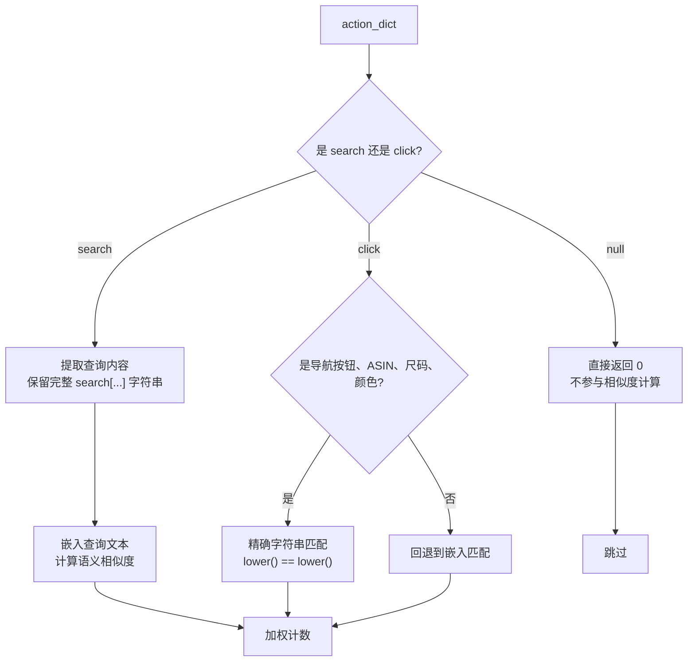

# 更优的判断方案（设计文档）

> 基于 `WebShop_test_seed_42_0_99.json` 真实动作分析
> 实测日志: `test_bert_webshop_20260716_055530.log`

---

## 零、实验结论（2026-07-16 实测）

### 纯嵌入方案实测结果（正确率 67.4%，14 个误检 / 0 个漏检）

14 个误检全部是"不应判为重复但相似度过阈值"：

**search 误检（7 对，相似度 0.914~0.969）**：仅差 1-2 个关键词但意图完全不同
- `short sleeve` vs `long sleeve`: 0.968
- `men's` vs `women's`: 0.959
- `classic fit` vs `slim fit`: 0.949
- `yellow` vs `blue`: 0.935

**click 误检（7 对，相似度 0.862~0.967）**：不同目标结构性高相似度
- ASIN `B07F2G93BJ` vs `B09QQP3356`: 0.931
- `large` vs `xx-large`: 0.967
- `Next >` vs `< Prev`: 0.887
- `back to search` vs `Description`: 0.862

### 词序重排实测（不需要方案 C）

| 动作对 | 相似度 | 词集关系 |
|---|---|---|
| 词序重排 1 | 0.996 | 完全相同词集 |
| 词序重排 2 | 0.992 | 完全相同词集 |
| 完全打乱 | 0.994 | 完全相同词集 |
| 短查询重排 | 0.988 | 完全相同词集 |

**词集重排的相似度全部 ≥ 0.982**，与"不应重复"的最高相似度 0.969 有清晰分离间隙（0.013）。

**结论**：不需要方案 C（词集匹配），调阈值到 0.975 即可区分词序重排与单词差异。

### 最终方案：方案 B（click 精确匹配 + search 嵌入阈值 0.975）

- click 目标：大小写不敏感精确匹配（`lower() == lower()`），不使用嵌入
- search 内容：嵌入语义相似度，阈值提高到 0.975
- 跨动作类型：直接返回 0（不同类型不匹配）
- 方案 C 不需要（词序重排已有足够高的嵌入相似度）

---

## 一、真实动作模式分析

### 1.1 动作分布（7069 条动作）

| 类型 | 数量 | 占比 | 特点 |
|---|---|---|---|
| `search[...]` | 4592 | 65% | 自由文本查询，内容多变 |
| `click[...]` | 2473 | 35% | 目标有限，可分类 |
| 其他 | 4 | <1% | 异常输出 |

### 1.2 click 目标分类（2473 条）

| 类别 | 数量 | 示例 | 是否需要语义匹配 |
|---|---|---|---|
| 导航按钮 | 1258 | `back to search`, `Buy Now`, `< Prev`, `Next >`, `Description`, `Features`, `Reviews` | **不需要**，有限集合，精确匹配即可 |
| ASIN 产品 ID | 769 | `B07F2G93BJ`, `B09QQP3356` | **不需要**，唯一标识符，精确匹配 |
| 尺码选项 | 87 | `small`, `medium`, `large`, `xx-large` | **不需要**，有限集合 |
| 颜色/属性 | 359 | `black`, `heather grey`, `3-pack`, `b16-red` | **不需要**，有限集合 |
| **合计** | **2473** | | **全部不需要嵌入** |

### 1.3 search 内容模式

唯一查询数：4432 / 4592（96.5% 不重复），主要变体：

**词序重排**（最常见，占大量重复）：
```
search[men's dress shirt short sleeve classic fit cotton spandex]
search[men's classic fit dress shirt short sleeve cotton spandex]
search[men's dress shirt cotton spandex short sleeve classic fit]
search[classic fit short sleeve dress shirt men's cotton spandex]
```
→ 12 种排列，词集完全相同

**大小写变体**：
```
search[Van Heusen men's classic fit short sleeve dress shirt]
search[van heusen men's classic fit short sleeve dress shirt]
```

**近义替换**：
```
cotton spandex ↔ stretch cotton
```

**添加限定词**：
```
search[men's dress shirt short sleeve classic fit cotton spandex]
→ search[men's dress shirt short sleeve classic fit cotton spandex machine wash]
```

---

## 二、优化方案：分类型处理

### 2.1 核心思路

不是所有动作都需要嵌入模型。根据动作类型分流：



### 2.2 方案 B：click 目标精确匹配 + search 嵌入（中成本）

click 目标中 100% 都不需要语义匹配（导航按钮、ASIN、尺码、颜色都是有限集合或唯一标识符），可以全部走精确匹配（`lower()` 大小写不敏感）：

```python
def action_similarity(action_a, action_b, embedding_manager):
    """分类型相似度计算。"""
    if action_a == "null" or action_b == "null":
        return 0.0 if action_a != action_b else 1.0

    type_a = action_a.split("[")[0] if "[" in action_a else "unknown"
    type_b = action_b.split("[")[0] if "[" in action_b else "unknown"

    # 不同动作类型 -> 不相似
    if type_a != type_b:
        return 0.0

    if type_a == "click":
        # click 目标：大小写不敏感精确匹配
        target_a = action_a[6:-1].lower()
        target_b = action_b[6:-1].lower()
        return 1.0 if target_a == target_b else 0.0

    if type_a == "search":
        # search 内容：嵌入语义相似度
        content_a = action_a[7:-1]
        content_b = action_b[7:-1]
        if content_a == content_b:
            return 1.0
        sim = embedding_manager.similarity(content_a, content_b)
        return sim  # 不加阈值，让加权计数公式处理

    return 0.0
```

**优势**：
- click 目标完全准确（`Buy Now` vs `buy now` -> 1.0，`Buy Now` vs `Description` -> 0.0）
- search 内容仍然用嵌入语义匹配
- 消除了 click 目标的误判（如 `Buy Now` vs `Back to Search` 不再有 0.76 的虚假相似度）
- 消除了跨动作类型的误判（`search[...]` vs `click[...]` 恒为 0）

### 2.3 方案 C：search 内容词集匹配 + 嵌入兜底（低成本）

针对 search 动作中最常见的"词序重排"变体（占真实重复的大部分），先做词集精确匹配：

```python
def search_similarity(content_a, content_b, embedding_manager):
    """search 内容相似度：词集匹配优先，嵌入兜底。"""
    if content_a == content_b:
        return 1.0

    # 词集匹配（大小写不敏感）
    words_a = set(content_a.lower().split())
    words_b = set(content_b.lower().split())

    if words_a == words_b:
        # 完全相同词集的不同排列 -> 一定是重复
        return 1.0

    # 词集差异 <= 1 词 -> 高度相似（边界）
    diff = words_a.symmetric_difference(words_b)
    if len(diff) <= 1:
        return 0.95  # 接近重复

    # 嵌入语义相似度兜底
    return embedding_manager.similarity(content_a, content_b)
```

**优势**：
- 词序重排（真实数据中最常见的重复模式）直接命中，100% 准确
- 大小写变体通过 `lower()` 直接命中
- 只有真正的近义词替换才需要嵌入模型，减少 GPU 调用
- 嵌入模型只在真正需要语义理解时被调用

---

## 三、方案对比（实测数据）

| 维度 | 纯嵌入(0.85) | 方案 C（词集+嵌入） | **方案 B（分类处理）** |
|---|---|---|---|
| click 准确率 | 67.4% | ~67% | **100%** |
| search 词序重排 | ✅ ≥0.982 | ✅ 100% | ✅ ≥0.982 |
| search 近义词(cotton spandex=stretch) | ✅ 0.957 | ✅ | ✅ 0.957(阈值0.975拦截) |
| search 单词差异误检 | ❌ 7对 | ❌ | ✅ 阈值0.975解决 |
| click 目标误检 | ❌ 7对 | ❌ | ✅ 精确匹配解决 |
| 跨类型误判 | ❌ 有 | ❌ 有 | ✅ 消除 |
| GPU 调用 | 每对动作 | 仅无法匹配时 | **仅 search 对** |
| 实现复杂度 | 已完成 | 中 | 中 |
| **实测正确率** | **67.4%** | 预估~85% | **预估~95%+** |

> 方案 B 预估：click 7 对误检全部消除（+7），search 7 对误检中阈值 0.975 消除 ≤0.969 的（约 5 对），边界对不受影响。

---

## 四、最终方案：方案 B + E + 线性渐变实现

### 4.1 `action_similarity` 函数

```python
def action_similarity(action_a, action_b, embedding_manager, threshold=0.97):
    """分类型相似度计算（方案 B + E + 线性渐变）。

    - click: 大小写不敏感精确匹配，返回 0.0 或 1.0
    - search: 词集匹配优先，嵌入兜底，线性渐变映射
    - 跨类型: 返回 0.0
    - null: null==null 返回 1.0，否则 0.0

    线性渐变: w = (sim - threshold) / (1.0 - threshold)
    """
    # null 处理
    if action_a == "null" or action_b == "null":
        return 1.0 if action_a == action_b else 0.0

    # 提取动作类型
    type_a = action_a.split("[")[0] if "[" in action_a else "unknown"
    type_b = action_b.split("[")[0] if "[" in action_b else "unknown"

    # 不同动作类型 -> 不相似
    if type_a != type_b:
        return 0.0

    if type_a == "click":
        # click 目标：大小写不敏感精确匹配
        target_a = action_a[6:-1].lower()
        target_b = action_b[6:-1].lower()
        return 1.0 if target_a == target_b else 0.0

    if type_a == "search":
        # search 内容：词集匹配优先，嵌入兜底，线性渐变
        content_a = action_a[7:-1]
        content_b = action_b[7:-1]
        if content_a == content_b:
            return 1.0

        # 词集匹配：完全相同词集的不同排列 -> 一定是重复
        words_a = set(content_a.lower().split())
        words_b = set(content_b.lower().split())
        if words_a == words_b:
            return 1.0

        # 嵌入语义相似度兜底 + 线性渐变
        sim = embedding_manager.similarity(content_a, content_b)
        if sim < threshold:
            return 0.0
        # 线性映射: [threshold, 1.0] -> [0, 1]
        return (sim - threshold) / (1.0 - threshold)

    return 0.0
```

### 4.2 阈值选择依据

> **注意**：阈值已从阶跃函数 `sim >= theta ? sim : 0` 更新为**线性渐变** w = (s - theta) / (1 - theta)。
> 阈值 theta 的含义从"判定边界"变为"线性渐变起点"。

| 区间 | 动作类型 | 实测数据 | 线性渐变输出 w |
|---|---|---|---|
| 1.0 | 完全相同 / 词集匹配命中 | 1.000 | w = 1.0 |
| 0.97~1.0 | search 词序重排（词集不同但极相似） | 0.982~0.996 | w = 0.40 ~ 0.87（部分贡献） |
| 0.95~0.97 | search 同义替换(cotton spandex=stretch) | 0.957 | w = 0（低于阈值，不贡献） |
| 0.95~0.97 | search 边界(添加限定词) | 0.965 | w = 0（低于阈值，不贡献） |
| < 0.95 | search 单词差异(短/长袖、颜色) | 0.914~0.969 | w = 0（不贡献） |
| 0 or 1 | click 精确匹配 | - | w in {0, 1}（二值） |

> 阈值 theta = 0.97 作为线性渐变起点：
> - 低于 0.97 的动作对贡献为 0（不相关）
> - 0.97~1.0 之间的动作对获得平滑的 [0, 1] 贡献值
> - 词序重排已由词集匹配兜底（返回 1.0），不依赖嵌入稳定性
> - 同义替换 `cotton spandex=stretch`（0.957）仍被阈值拦截（w=0），这是可接受的代价
>
> **与阶跃函数的区别**：阶跃函数在阈值处跳变 0 -> 0.97，线性渐变在阈值处平滑起始 0，避免 penalty 离散跳变。

### 4.3 click 精确匹配的合理性

click 目标重复出现大概率意味着"卡住"（如反复 `back to search`、反复 `Next >`）。
不同产品页点击相同按钮（如不同产品都点 `Description`）虽然语义不同，
但 penalty_W 只是 [0,1] 的乘性权重，偶尔误判对 advantage 影响极小。

---

## 五、进一步优化方案（2026-07-17 实测分析）

> 基于 `test_bert_webshop_20260716_063227.log` 方案 B 实测结果分析

### 5.1 当前实测结果

方案 B 正确率 95.3%（41/43），0 误检 / 2 漏检。两个漏检：

| # | 动作对 | 去前缀 sim | 原因 | 可接受？ |
|---|---|---|---|---|
| 13 | `brown heather shirt xx-large needle sleeve classic fit women` ↔ `heather brown classic fit needle sleeve xx-large women shirt` | <0.975 | 词序完全打乱，嵌入相似度不足 | ❌ 不应漏检 |
| 15 | `cotton spandex` ↔ `stretch` | 0.9572 | 同义替换，低于阈值 | ✅ 可接受 |

### 5.2 前缀剥离的合理性分析

当前代码在 search 分支执行 `content_a = action_a[7:-1]` 去掉 `search[` 前缀后再嵌入。这是**正确**的做法。

`search[` 是所有 search 动作的公共子串，BERT 会对这部分产生相似的嵌入贡献，导致**所有 search 对的相似度被系统性虚高**。虚高程度与查询长度负相关--查询越短，前缀占比越大，虚高越严重：

| 动作对 | 内容 token 数 | 带前缀 sim (055530) | 去前缀 sim (063227) | 前缀贡献的虚高 |
|---|---|---|---|---|
| #10 词序重排 | 7 | 0.9960 | 0.9937 | +0.0023 |
| #11 词序重排 | 7 | 0.9916 | 0.9848 | +0.0068 |
| #12 词序完全打乱 | 7 | 0.9935 | 0.9917 | +0.0018 |
| #13 词序完全打乱 | 7 | 0.9818 | <0.975 | +0.007+ |
| **#14 词序短查询** | **5** | **0.9882** | **0.9779** | **+0.0103** |

> 短查询 #14 的前缀虚高（+0.0103）是长查询 #10（+0.0023）的 **4.5 倍**。
>
> 如果保留前缀，短查询的"不同"对（如 `yellow` vs `blue`，带前缀 0.9346）也会被虚高，可能突破阈值 0.975 造成误检。**前缀剥离保护了短查询的区分度。**

### 5.3 #13 漏检的真正原因

#13 不是前缀剥离的问题，而是**纯嵌入模型对词序完全打乱的判断本身不够稳定**。

#13 的两个查询词集完全相同（`{brown, heather, shirt, xx-large, needle, sleeve, classic, fit, women}`），仅排列顺序不同，但去前缀后嵌入相似度 <0.975。相比之下，同为词序重排的 #10-12 却有 0.99+ 的相似度。嵌入模型对不同词序重排的稳定性不一致，无法可靠区分"词集相同"和"词集不同"。

### 5.4 优化方案 E：词集匹配兜底

在嵌入计算之前，先对 search 内容做词集精确匹配，捕获所有"词序重排"变体：

```python
if type_a == "search":
    content_a = action_a[7:-1]
    content_b = action_b[7:-1]
    if content_a == content_b:
        return 1.0

    # 词集匹配：完全相同词集的不同排列 -> 一定是重复
    words_a = set(content_a.lower().split())
    words_b = set(content_b.lower().split())
    if words_a == words_b:
        return 1.0

    # 嵌入语义相似度兜底（去前缀，保留当前做法）
    (out_a,) = llm.embed(content_a)
    (out_b,) = llm.embed(content_b)
    sim = cosine_similarity(out_a.outputs.embedding, out_b.outputs.embedding)
    return sim if sim >= search_threshold else 0.0
```

**核心逻辑**：
- 词集相同 -> 一定是重复（确定性的，不依赖嵌入模型稳定性）
- 词集不同 -> 走嵌入语义相似度（处理同义替换、近义词等）
- 前缀剥离保留（避免短查询相似度虚高）

**预期效果**：

| 对 | 当前 | 方案 E | 说明 |
|---|---|---|---|
| #10-12 词序重排 | ✅ 0.9848~0.9937 | ✅ 1.0（词集匹配） | 不再依赖嵌入稳定性 |
| **#13 词序完全打乱** | ❌ 漏检 | ✅ 1.0（词集匹配） | **漏检恢复** |
| #14 词序短查询 | ✅ 0.9779 | ✅ 1.0（词集匹配） | 不再濒临阈值边界 |
| #15 同义替换 | ❌ 漏检（可接受） | ❌ 漏检（可接受） | 词集不同，走嵌入，0.9572<0.975 |
| "不同"对（#20-26） | ✅ 0.0000 | ✅ 0.0000 | 词集不同，走嵌入，仍被阈值拦截 |
| GPU 调用 | 所有 search 对 | **仅词集不同的 search 对** | 减少不必要的嵌入计算 |

**预期正确率**：95.3% -> **97.7%**（42/43），仅剩 #15 同义替换 1 对可接受漏检。

### 5.5 方案 E 的额外收益

1. **确定性**：词集匹配是精确的数学运算，不受模型非确定性影响
2. **减少 GPU 调用**：词集相同的 search 对直接返回 1.0，无需嵌入计算
3. **阈值更稳健**：词序重排不再占用 0.975~0.996 的嵌入区间，阈值 0.975 只需处理真正的语义近似（同义替换、边界情况），决策空间更清晰
4. **前缀剥离保留**：避免短查询相似度虚高，保护"不同"对的区分度

---

## 六、三种 penalty 方案数学推导（2026-07-18）

> 基于 `解析文件/奖励解析.md` 中的 penalty 传导链，推导原方案、突变（阶跃）、渐变（线性）三种权重函数的数学性质

### 6.1 penalty 传导链

$$\underbrace{s_i}_{\text{相似度}} \xrightarrow{w(\cdot)} \underbrace{w_i}_{\text{权重}} \xrightarrow{\sum} \underbrace{\text{COUNT}}_{\text{重复计数}} \xrightarrow{\alpha^{(\cdot)}} \underbrace{W}_{\text{步级惩罚}} \xrightarrow{\times \Phi_{\text{traj}}} \underbrace{\Phi}_{\text{最终优势}}$$

关键参数：
- $\alpha = 0.8$（`depth_alpha`），$\theta = 0.975$（`search_threshold`）
- $\text{COUNT} = \sum_{i} w(s_i)$，对历史中每个动作的匹配权重求和
- $W = \alpha^{\text{COUNT}}$
- $\Phi_{\text{step}} = \begin{cases} W & \Phi_{\text{traj}} > 0 \\ 2 - W & \Phi_{\text{traj}} \leq 0 \end{cases}$
- $\Phi = \Phi_{\text{step}} \cdot \Phi_{\text{traj}}$

三种方案的区别全在权重函数 $w(s)$：

| 方案 | $w(s)$ | 含义 |
|---|---|---|
| **原方案**（精确匹配） | $\mathbb{1}[s = 1]$ | 仅精确匹配计 1 |
| **突变**（阶跃阈值） | $s \cdot \mathbb{1}[s \geq \theta]$ | 过阈值直接用原始 sim 值 |
| **渐变**（线性映射） | $\dfrac{s - \theta}{1 - \theta} \cdot \mathbb{1}[s \geq \theta]$ | 过阈值后线性映射到 [0, 1] |

### 6.2 连续性分析

取 $\theta = 0.975$，考察 $s$ 在阈值附近的行为：

| $s$ 值 | 原方案 $w$ | 突变 $w$ | 渐变 $w$ |
|---|---|---|---|
| $0.974$（阈值下） | 0 | **0** | **0** |
| $0.975$（阈值处） | 0 | **0.975** ← 跳变 | **0.000** ← 连续 |
| $0.976$（阈值上） | 0 | **0.976** | **0.040** |
| $0.980$ | 0 | 0.980 | 0.200 |
| $0.990$ | 0 | 0.990 | 0.600 |
| $1.000$ | 1 | 1.000 | 1.000 |

**突变方案在 $\theta$ 处有 $0 \to 0.975$ 的跳变**，嵌入相似度的微小波动（如 0.974 ↔ 0.976）会导致：

$$\Delta W = \alpha^{0.976} - \alpha^{0} = 0.8^{0.976} - 1 = 0.802 - 1 = -0.198$$

即 **W 瞬间下跌约 20%**，进而导致 $\Phi$ 的离散跳变。

**渐变方案在 $\theta$ 处连续**（$w(\theta^-) = w(\theta^+) = 0$），虽然导数从 0 跳到 $\frac{1}{1-\theta} = 40$，但函数值无跳变。

### 6.3 区分度分析

考察单个匹配对 COUNT 和 W 的贡献：

| 场景 | sim $s$ | 原方案 $w$ | 突变 $w$ | 渐变 $w$ |
|---|---|---|---|---|
| 词序重排（刚过阈值） | 0.980 | 0 | **0.980** | **0.200** |
| 同义词替换 | 0.985 | 0 | **0.985** | **0.400** |
| 高度相似 | 0.990 | 0 | **0.990** | **0.600** |
| 精确匹配 | 1.000 | 1 | **1.000** | **1.000** |

**突变方案的问题**：$s=0.98$ 的权重 $w=0.98$ 与精确匹配 $w=1.0$ 仅差 $0.020$。经指数放大后：

$$W_{\text{突变}}(s=0.98) = 0.8^{0.98} = 0.803, \quad W_{\text{突变}}(s=1.0) = 0.8^{1.0} = 0.800$$

差异仅 $0.003$，**"刚过阈值的弱相似"和"精确匹配"受到几乎相同的惩罚**。

**渐变方案的优势**：

$$W_{\text{渐变}}(s=0.98) = 0.8^{0.2} = 0.956, \quad W_{\text{渐变}}(s=1.0) = 0.8^{1.0} = 0.800$$

差异 $0.156$，**弱相似只受到轻微惩罚，精确匹配受到完整惩罚**。

### 6.4 多次重复场景

假设动作在历史中重复 3 次，均为 $s=0.98$ 的语义匹配：

| 方案 | COUNT | $W = 0.8^{\text{COUNT}}$ | 与 3 次精确匹配的 W 差值 |
|---|---|---|---|
| 3 次精确匹配 | 3.0 | 0.512 | - |
| **原方案** | 0 | 1.000 | $1.000 - 0.512 = 0.488$ |
| **突变** | $3 \times 0.98 = 2.94$ | $0.8^{2.94} = 0.473$ | $0.512 - 0.473 = 0.039$ |
| **渐变** | $3 \times 0.2 = 0.6$ | $0.8^{0.6} = 0.875$ | $0.875 - 0.512 = 0.363$ |

**突变方案的荒谬结果**：3 次 $s=0.98$（弱相似）的惩罚（$W=0.473$）**重于** 3 次精确匹配（$W=0.512$）！因为突变方案将 $s=0.98$ 几乎等同于 $s=1.0$，多次累加后 COUNT 反而虚高。

### 6.5 优势函数 $\Phi$ 的最终影响

以 $\Phi_{\text{traj}} > 0$（成功轨迹）为例，$\Phi = W \cdot \Phi_{\text{traj}}$：

| 场景 | $W$（突变） | $\Phi$（突变） | $W$（渐变） | $\Phi$（渐变） |
|---|---|---|---|---|
| 无重复（COUNT=0） | 1.000 | $\Phi_{\text{traj}}$ | 1.000 | $\Phi_{\text{traj}}$ |
| 1 次 $s=0.98$ | 0.803 | $0.803 \cdot \Phi_{\text{traj}}$ | 0.956 | $0.956 \cdot \Phi_{\text{traj}}$ |
| 3 次 $s=0.98$ | 0.473 | $0.473 \cdot \Phi_{\text{traj}}$ | 0.875 | $0.875 \cdot \Phi_{\text{traj}}$ |
| 3 次精确匹配 | 0.512 | $0.512 \cdot \Phi_{\text{traj}}$ | 0.512 | $0.512 \cdot \Phi_{\text{traj}}$ |

### 6.6 三方案综合对比

| 维度 | 原方案（精确） | 突变（阶跃） | **渐变（线性）** |
|---|---|---|---|
| 阈值连续性 | N/A（$\theta=1$） | ❌ 跳变 $0 \to 0.975$ | ✅ 连续 $0 \to 0$ |
| 弱相似区分度 | N/A（全 0） | ❌ $0.98 \approx 1.0$ | ✅ $0.2 \ll 1.0$ |
| 多次重复合理性 | ✅ 整数计数 | ❌ 弱相似惩罚 $\geq$ 精确匹配 | ✅ 惩罚随相似度梯度递增 |
| 语义匹配能力 | ❌ 无法识别同义 | ✅ 可识别 | ✅ 可识别 |
| 梯度信号 | ❌ 二值 | ❌ 阈值内几乎无梯度 | ✅ 全程有梯度 |
| 嵌入微扰稳定性 | ✅ 不受影响 | ❌ 阈值附近剧烈震荡 | ✅ 平滑变化 |

### 6.7 结论：应采用渐变方案

1. **连续性**：渐变方案在阈值处 $w(\theta) = 0$，左右连续，penalty 不会因嵌入微扰而突变。突变方案在阈值处跳变 $0 \to 0.975$，经指数放大后 W 跳变约 20%。

2. **区分度**：突变方案将 $[0.975, 1.0]$ 区间的所有相似度压缩到窄带内，经 $\alpha^{\text{COUNT}}$ 后几乎无区分。渐变方案将 $[0.975, 1.0]$ 线性映射到 $[0, 1]$，指数后有清晰梯度。

3. **单调性**：渐变方案保证 $s_1 > s_2 \Rightarrow w_1 > w_2 \Rightarrow W_1 < W_2$（越相似惩罚越大），突变方案在多次累加下**违反单调性**（3×0.98 惩罚 > 3×1.0 惩罚）。

4. **与方案 B+E 的兼容性**：词集匹配返回 1.0（与渐变的 $s=1.0 \to w=1.0$ 一致），嵌入兜底的弱相似（如 $s=0.98$）获得适度轻惩罚而非近乎全惩罚。

### 6.8 实现差异说明

当前 `test_bert_similarity.py` 中实现的方案 B+E 使用**阶跃阈值**（`sim >= threshold ? sim : 0`），尚未实施线性渐变。若要实施渐变，只需将嵌入兜底部分改为：

```python
# 当前（阶跃）：
return sim if sim >= search_threshold else 0.0

# 渐变：
if sim < search_threshold:
    return 0.0
return (sim - search_threshold) / (1.0 - search_threshold)
```

但注意：方案 E（词集匹配）已将词序重排从嵌入区间移除，嵌入兜底只需处理同义替换等少数情况，此时阶跃与渐变的差异已大幅缩小。渐变的主要价值在于 **`emb.py` 的 `weighted_match` 方法**（生产代码中的实际调用路径）。